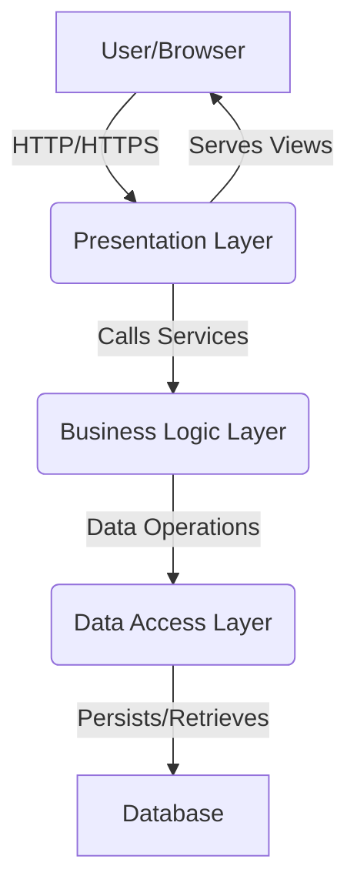

# System Architecture Document

## 1. Introduction
This document provides a high-level overview of the system architecture for the Course Management System. It outlines the main components, their interactions, and the underlying technologies used to build the application.

## 2. Architectural Style
The system adopts a layered architectural style, commonly seen in N-tier applications, with a strong emphasis on the Model-View-Controller (MVC) pattern for the presentation layer.

## 3. High-Level Diagram

## 4. Architectural Layers and Components

### 4.1. Presentation Layer
- **Technology**: ASP.NET Core MVC, HTML, CSS, JavaScript (Razor Views)
- **Purpose**: Handles user requests, renders views, and manages user interaction. It acts as the entry point for the application.
- **Key Components**:
    - **Controllers (`PresentationLayer/Controllers`)**: Receive incoming HTTP requests, process input, interact with the Business Logic Layer, and return appropriate views or API responses.
        - Example: `InstructorController` manages all instructor-specific course operations.
    - **Views (`PresentationLayer/Views`)**: `.cshtml` files responsible for rendering the UI. They display data passed from controllers.
        - Example: `Dashboard.cshtml`, `Create.cshtml` for course management.
    - **View Models (`PresentationLayer/ViewModels`)**: Plain C# objects used to pass strongly-typed data between Controllers and Views, encapsulating data specific to the view's needs.

### 4.2. Business Logic Layer (BLL)
- **Technology**: C#
- **Purpose**: Contains the core business rules, logic, and processes of the application. It orchestrates operations, validates data, and ensures the application adheres to its functional requirements.
- **Key Components**:
    - **Services (`BusinessLogicLayer/Services`)**: Implement the application's business rules and workflows. They expose APIs that are consumed by the Presentation Layer.
    - **Interfaces (`BusinessLogicLayer/Interfaces`)**: Define contracts for the services, promoting loose coupling and testability.

### 4.3. Data Access Layer (DAL)
- **Technology**: C#, Entity Framework Core (or similar ORM)
- **Purpose**: Responsible for abstracting the underlying data storage mechanism. It provides methods for CRUD (Create, Read, Update, Delete) operations and maps data between the object model and the database schema.
- **Key Components**:
    - **Models (`DataAccessLayer/Models`)**: Represent the entities stored in the database (e.g., `Course`, `Module`, `Lesson`).
    - **Repositories (`DataAccessLayer/Repositories`)**: Provide a collection-like interface to access entities. They encapsulate the logic required to work with data sources.
    - **Database Context (`DataAccessLayer/Context`)**: Manages the database connection and transactions.

### 4.4. Database
- **Technology**: Relational Database (e.g., PostgreSQL, SQL Server)
- **Purpose**: Stores all application data, including user information, course details, modules, lessons, etc.
- **Key Characteristics**: Ensures data integrity, consistency, and provides efficient data retrieval.

### 4.5. Common Layer
- **Technology**: C#
- **Purpose**: A cross-cutting layer for shared utilities, helper functions, extension methods, and common types used across multiple layers.

## 5. Data Flow Example: Creating a Course
1. **User Action**: An instructor fills out the "Create Course" form in the browser and submits it.
2. **Presentation Layer**:
    - The HTTP POST request is received by the `InstructorController.Create` action.
    - The controller binds the form data to a View Model.
    - The controller calls a service method in the Business Logic Layer, passing the necessary data.
3. **Business Logic Layer**:
    - A service method (e.g., `CourseService.CreateCourseAsync`) receives the data.
    - It applies business rules (e.g., validation, default values).
    - It calls a repository method in the Data Access Layer to persist the new course.
4. **Data Access Layer**:
    - A repository method (e.g., `CourseRepository.AddAsync`) maps the course object to a database entity.
    - It uses the database context to add the new entity to the database.
5. **Database**: The new course record is inserted into the `Courses` table.
6. **Response**: The service returns success/failure to the controller, which then redirects the instructor to a dashboard or displays a confirmation message.

## 6. Security Considerations
- **Authentication & Authorization**: Handled at the Presentation and Business Logic Layers to ensure only authorized users can access specific functionalities.
- **IDOR Protection**: Critical operations verify user ownership of resources (e.g., `IsOwnerOfCourseAsync` in `InstructorController`).
- **Input Validation**: Performed at the Presentation and Business Logic Layers to prevent malicious data injection.
